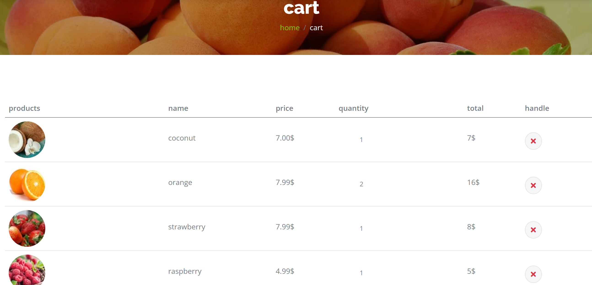
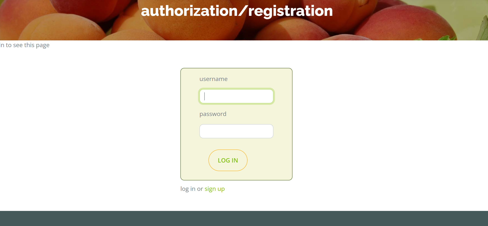
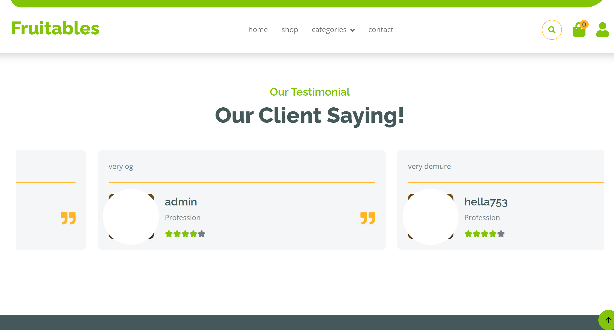

# Fruit and Vegetable Shop Website

A feature-rich **Fruit and Vegetable Shop** website built using Django and SQLite3. This project is designed for learning purposes and comes with a fully functional database containing several test records.

---

## Table of Contents

1. [Project Description](#project-description)
2. [Features](#features)
3. [Project URLs](#project-urls)
4. [Components](#components)
   - [Apps Overview](#apps-overview)
   - [Templates Structure](#templates-structure)
5. [Dependencies](#dependencies)
6. [How to Run the Project](#how-to-run-the-project)
7. [Screenshots](#screenshots)
8. [Credits](#credits)

---

## Project Description

This website is a **Fruit and Vegetable Shop** built using a free template and powered by Django. It uses SQLite3 as its database, with preloaded records for testing and demonstration purposes.

---

## Features

1. **Language Translation**  
   - Translation for templates, admin, and models using `django-modeltranslation` and `django-rosetta`.  
   - UI includes a dropdown menu and button for changing the language.

2. **Management Command**  
   - Custom management command to find the most popular products:
     ```bash
     python manage.py most_popular
     ```
     To fetch a specific number of products:
     ```bash
     python manage.py most_popular --number X
     ```
     
3. **Cart Functionality**  
   - The `CartItemForm` and views `AddToCartView` and `AddToCartDeleteView` manage adding and removing items.  
   - Checks stock availability before adding items.  

4. **Search and Pagination**  
   - Custom template tag `pagination_filtering.py` ensures pagination works with filtering, search, and sorting.

5. **User Authentication**  
   - Registration and login implemented with customized Django auth views.

6. **Admin Functionality**  
   - Automatic slug generation for models using custom `ModelAdmin`.  
   - Custom `LoginRequiredMixin` to secure cart-related pages.

7. **Caching**  
   - Low-level caching for store categories and template caching for the navbar.

8. **Error Handling**  
   - Custom error handlers for `404` and `500`.

9. **Email Integration**  
   - `Contact` form with email sending functionality via SMTP.

10. **Reusable Code**  
    - `SearchMixin` for modular search functionality.  
    - `context_processors.py` for global context variables.  
    - Middleware to update user activity and session expiration.

11. **Visual Enhancements**  
    - Cart item count displayed on the navbar.  
    - Components like `spinner` and `search` reusable across templates.
 
---

## Project URLs

| **Page**       | **URL**                                           | **Description**                                                                                 |
|-----------------|---------------------------------------------------|-------------------------------------------------------------------------------------------------|
| Home           | `/`                                               | Homepage.                                                                                      |
| Shop           | `/category/` or `/category/<category-slug>/`      | Displays root categories and products under a specific category.                               |
| Product Detail | `/product/<product-slug>/`                        | Detailed page of a product.                                                                   |
| Contact        | `/contact/`                                       | Contact form page.                                                                             |
| Cart           | `/order/cart/`                                    | Displays items in the cart. Accessible via the navbar cart icon.                               |
| Checkout       | `/order/checkout/`                                | Checkout page. Accessible via the "Proceed to Checkout" button on the cart page.              |
| Admin Panel    | `/admin/`                                         | Admin portal. Use credentials: username: `admin`, password: `admin`.                          |
| Login          | `/accounts/login/`                                | Login page. Accessible via the navbar icon.                                                   |
| Register       | `/accounts/register/`                             | Registration page. Accessible via the login page link.                                         |
| Rosetta        | `/rosetta/`                                       | Translation admin interface. Link available in the admin dashboard.                           |

---

## Components and Features

### Apps Overview

1. **`store`**  
   - Contains models: `Product`, `Category`, `ProductReviews`, `ShopReviews`, `ProductTags`.  
   - Handles homepage, shop, product detail, and contact views.

2. **`order`**  
   - Models: `Checkout`, `Cart`, `CartItems`.  
   - Manages cart functionality, item addition/removal, and checkout process.

3. **`user`**  
   - Custom user management app.

4. **`utils`**  
   - Contains helper functions and global context processors.

5. **`middlewares`**  
   - Custom middlewares for session and user activity management.

6. **`mixins`**  
   - Reusable mixins for search functionality and access control.

7. **`locale`**  
   - Directory for translation files.

---

### Templates Structure

1. **Cart**  
   - `base_cart.html`, `cart.html`.

2. **Checkout**  
   - `base_checkout.html`, `checkout.html`.

3. **Contact**  
   - `base_contact.html`, `contact.html`.

4. **Homepage**  
   - `base_index.html`, `index.html`.

5. **Product Detail**  
   - `base_detail.html`, `shop-detail.html`.

6. **Shop**  
   - `base_shop.html`, `shop.html`.

7. **Reusable Components**  
   - Includes `navbar`, `spinner`, `search`.

8. **Base and Footer**  
   - Shared layout in `base.html` and `footer.html`.

9. **Registration**  
   - Templates for user registration and authorization.

---

## Dependencies

- Python 3.X  
- Django 5.1.1  
- Pillow 11.0.0  
- Django-debug-toolbar  
- Django-mptt  
- django-versatileimagefield~=3.1  
- python-magic-bin  
- django-rosetta  
- django-modeltranslation  

---

## How to Run the Project

1. Clone the repository:
   ```bash
   git clone https://github.com/hella753/fruit_and_vegetable_shop_django.git
   cd fruit_and_vegetable_shop_django
    ```
2. Install the dependencies:
    ```bash
    pip install -r requirements.txt
    ```
3. Run the server:
   ```bash
   python manage.py runserver
   ```
4. Open the browser and visit `http://127.0.0.1:8000

---

## Screenshots

### Shop


### Cart


### Authorization


### Review


---

## Credits
Template: This project uses a free template from [themewagon | https://themewagon.com/].
